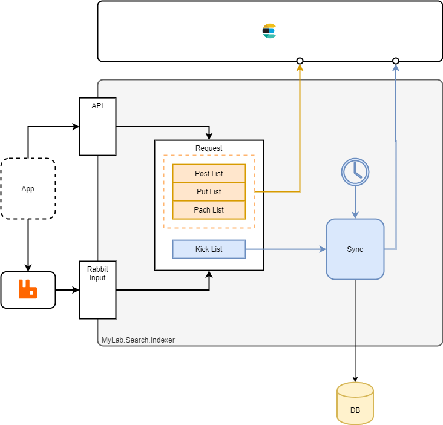

# MyLab.Search.Indexer

`Docker` образ: [](https://github.com/mylab-search-fx/indexer/pkgs/container/indexer)

Спецификация `API` : [-green)](https://app.swaggerhub.com/apis/ozzy/MyLab.Search.Indexer/1)

Клиент: [](https://www.nuget.org/packages/MyLab.Search.IndexerClient/)

Индексирует данные из базы данных и/или `RabbitMQ` в `ElasticSearch`.

## Обзор



На схеме выше показаны все участники процесса индексации и их связи.

Процесс индексации определяет следующие особенности:

* данные могут быть получены:
  * из `БД`;
  * через очередь;
  * через `WEB API`.

* база данных является приоритетным источником, т.е. если данные об индексируемой сущности приходят через очередь или `api`, то они перезапишутся данными из БД в ближайшей итерации по расписанию;
* при совместном использовании, очерди/`api` и БД, назначение очереди/`api` - максимально быстро доставить данные для индексирования;
* поддерживается индексация нескольких сущностей.

## Множественная индексация

Приложение `Indexer` определяет абстракцию `Namespace`, объединяющую настроки индексации сущностей из БД, очереди и `api`. `Indexer` через конфигурацию поддерживает указание нескольких `Namespace`, что позволяет использовать один экземпляр `Indexer` для индекксирования нескольких типов сущностей, которые извлекаются разными запросами, получаются из разных очередей и индексируются в разных индексах по разным правилам.

Все объявленные `Namespace`-ы синхронизируются последовательно, в соответствии с конфигурацией в рамках каждой итерации. В случае получения сообщений из очереди, `Namespace` определяется по очереди, из которой получено сообщение. При обращзении через `API` имя `Namespace` передаётся в запросе.
## Индексация через БД

Выборка даных для индексации осуществляется в соответствии с настройками и "отступом" последней выборки - `seed`. В зависимости от выбранной стратегии выборки, `seed` может принимать целочисленное значение или дату и время. В конце каждой итерации новый `seed` сохраняется в локальный файл. В начале очередной итерации - загружается. Если это первая итерации или файл не найден, то используется минимальное значение соответствующего типа.

Индексация через базу данных осуществляется по вызову планировщика и подразумевает следующий алгоритм:

* определяется `seed`(состояние), с которого начнётся выборка (загружается ранее сохранённый или минимальное значение);
* загрузка и индексирование данных по частям (paging) или целиком в зависимости от настроек:
  * происходит выборка данных;
  * данные оптравляются в `ElasticSearch` для индексации;
* определяется новый `seed` и сохраняется в файл.

Запрос БД может быть указан в: 

* конфигурации `Namespace`-а: `Indexer.Namespaces[].DbQuery`

* или размещён в файле, путь которого состоит из следующих частей:

  * базовый путь к директории с файлами `Namespace`-ов из конфигурации `Indexer.NamespacesPath` = `/etc/mylab-indexer/namespaces` (по умолчанию);
  * идентификатор `Namespace`-а;
  * `sync.sql`.

  Пример:

  ```
  /etc/mylab-indexer/namespaces/users/sync.sql
  ```

Запрос представляет из себя `SQL` запрос, в котором доступны следующие переменные:

- `seed` - "отсутп" очередного запроса;
- `offset` - сдвиг выборки 
- `limit` - предел выборки

Для индексации только новых данных необходимо применить в запросе переменную `seed` в соответствии с выбранной стратегией. Для реализации порциональной выборки и иендекцации в рамках одной итерации, необходимо в запросе испольщовать параметры `offset` и `limit`. 

Ниже приведён пример использования всех параметров в контексте БД `sqlite`:

```sql
select * from foo_table where LastModified > @seed limit @limit offset @offset
```

### Стратегия `Add`

Испольуется в случае, если данные только добавляются. Например - протокол действий. 

При этой стратегии:

* идентификатор сущности должен принимать целочисленные значения;
* очередная сущность должна иметь идентификатор с большим значением, чем предыдущая;
* `seed` будет иметь самое большое значение идентификатора сущности из последней итерации;
* нужно использовать `seed` в запросе для сравнения с полем-идентификатором.

Пример `sql` запроса:

```sql
select * from foo_table where Id > @seed
```

### Стратегия `Update`

Испольуется в случае, если данные могут добавляться и имзенять. 

При этой стратегии:

* идентификатор сущности может быть любого типа;
* должно быть поле типа дата+время (например, `LastModified`), которе будет обновляться при обновлении сущности;
* `seed` будет иметь самое большое значение даты+времени "`LastModified`" из последней итерации;
* нужно использовать `seed` в запросе для сравнения с полем "`LastModified`";
* поле `LastModified` не будет индекстироваться.

Пример `sql` запроса:

```sql
select * from foo_table where LastModified > @seed
```

## Push индексация

`Push`-индексация - подход, подразумевающий передачу полноценной сущности со всеми её полями для индексации. При этом переданная сущность полностью заменяет сущость, проиндексированную ранее с тем же идентификатором.

Не в зависимости от того, изменена ли сущетсвующая сущность или создаётся новая, передаваться в сообщении должны все актуальные данные в том виде, в каком они будут индексироваться. В случае, если сущность новая, то запись о ней появится в `ElasticSearch`. Если сущность была изменена и её индесированная копия уже есть в `ElasticSearch`, то данные будут заменены. Сопоставление переданной сущности и индексированной копии происходит по полю, указанному в настройках `Indexer.Namespaces[].IdProperty` (поле-идентификатор).

### Push через очередь

При индексации через очередь, сущности передаются по одному в формате `JSON`.

Ниже приведён пример отправки тестовой сущности. В настройках поле-идентификатор - `Id`:

```C#
public class SearchTestEntity
{
    public long Id { get; set; }
    public string Value { get; set; }
}
```

Тело сообщения #1 в очереди:

```json
{"Id":2,"Value":"foo"}
```

Результат поиска #1 индексированной сущности (лишнее обрезано):

```json
{ "_source": { "Id": 2, "Value": "foo" } }
```

Тело сообщения #2 в очереди:

```json
{"Id":2,"Value":"bar"}
```

Результат поиска #2 индексированной сущности (лишнее обрезано):

```json
{ "_source": { "Id": 2, "Value": "bar" } }
```

### Push через API

При индексации через `api`, сущности передаются в формате `JSON`.

Ниже приведён пример отправки тестовой сущности. В настройках поле-идентификатор - `Id`:

```c#
public class SearchTestEntity
{
    public long Id { get; set; }
    public string Value { get; set; }
}
```

Запрос #1:

```http
POST /v1/test-namespaces

Content-Type: application/json
Content-Length: 20

{"Id":2,"Value":"foo"}
```

Результат поиска #1 индексированной сущности (лишнее обрезано):

```json
{ "_source": { "Id": 2, "Value": "foo" } }
```

Запрос #2:

```http
POST /v1/test-namespaces

Content-Type: application/json
Content-Length: 20

{"Id":2,"Value":"bar"}
```

Результат поиска #2 индексированной сущности (лишнее обрезано):

```json
{ "_source": { "Id": 2, "Value": "bar" } }
```

## Kick индексация

`Kick`-индексация - подход, подразумевающий передачу идентификатора сущности для дальнейшей её переиндексации из первоисточника - БД.

При `kick`-индексации, среди прочих, необходимо указывать следующие параметры для `Namespace`:

* `IdPropertyType`
* `KickDbQuery` или файл `kick.sql` в ресурсах `Namespace`-а.

`Kick` `sql` запрос должен осуществлять выборку записи для инлексации по идентификатору, где для сравнения с идентификатором испольщуется переменная `id`:

```sql
select * from foo_table where Id > @id
```

### Kick через API

Ниже приведён пример индексации сущности через `kick`-запрос. В настройках поле-идентификатор - `Id`:

```c#
public class SearchTestEntity
{
    public long Id { get; set; }
    public string Value { get; set; }
}
```

Результат поиска #1 индексированной сущности (лишнее обрезано):

```json
{ "_source": { "Id": 2, "Value": "foo" } }
```

Приложение обновляет сущность в БД:

```sql
DECLARE @Value_1 VarChar(3) -- String
SET     @Value_1 = 'bar'

UPDATE
	`test` `e`
SET
	`e`.`Value` = @Value_1
WHERE
	`e`.`Id` = 2
```

`kick`-запрос:

```http
POST /v1/test-namespaces/2/kick
```

Результат поиска #2 индексированной сущности (лишнее обрезано):

```json
{ "_source": { "Id": 2, "Value": "bar" } }
```

## Удаление из индекса

Данное решение не реализует удаление индексированных данных. Например, при удалении сущности из БД. 

Подразумеваются следующие варианты решения:

* самостоятельно реализовать удаление идексируемых сущностей;
* не удалять сущности, а помечать их как удалённые, что с точки зрения `Indexer` является изменением сущности.

## Создание индекса

Если в процессе индексирования, `Indexer` обнаружит, что целевой индекс в `ElasticSearch` отсутствует, то он попытается его сздать. При этом, будут использованы настройки в соответствии со стратегией определения настроек инлекса из параметра конфигурации приложения `Indexer.Namespaces[].NewIndexStrategy`, который может принимать значения: `Auto`/`File`.

### Cтратегия  `Auto`

По этой стратегии, `Indexer` в настройках указывает только сопоставление сущности (`mapping`). Сопосталвение вычисляется атоматически на основании информации о первой сущности из полученной выборки или о сущности из сообшения очереди. 

#### Сопоставление сущности из очереди

Для вычилсения сопоставления на основе сущности, полученной из очереди, применяется следующий алгоритм:

* сопоставляются все поля сущности;
* используется оригинальное имя поля;
* тип поля определяется следующим образом:
  * `boolean` - если [валидное значение](https://docs.microsoft.com/ru-ru/dotnet/api/system.boolean.tryparse?view=net-5.0) [bool](https://docs.microsoft.com/ru-ru/dotnet/api/system.boolean?view=net-5.0);
  * `long` - если [валидное значение](https://docs.microsoft.com/ru-ru/dotnet/api/system.int64.tryparse?view=net-5.0#System_Int64_TryParse_System_String_System_Globalization_NumberStyles_System_IFormatProvider_System_Int64__) [long](https://docs.microsoft.com/ru-ru/dotnet/api/system.int64?view=net-5.0) для [инвариантной культуры](https://docs.microsoft.com/ru-ru/dotnet/api/system.globalization.cultureinfo.invariantculture?view=net-5.0);
  * `double` - если [валидное значение](https://docs.microsoft.com/ru-ru/dotnet/api/system.double.tryparse?view=net-5.0) [double](https://docs.microsoft.com/ru-ru/dotnet/api/system.double?view=net-5.0)  для [инвариантной культуры](https://docs.microsoft.com/ru-ru/dotnet/api/system.globalization.cultureinfo.invariantculture?view=net-5.0);
  * `date` - если [валидное значение](https://docs.microsoft.com/ru-ru/dotnet/api/system.datetime.tryparse?view=net-5.0#System_DateTime_TryParse_System_String_System_DateTime__) [DateTime](https://docs.microsoft.com/ru-ru/dotnet/api/system.datetime?view=net-5.0);
  * `text` - в остальных случаях.

#### Сопостовление сущности из БД

Для вычилсения сопоставления на основе сущности, полученной из БД, применяется следующий алгоритм:

* сопоставляются все поля сущности;
* используется оригинальное имя поля;
* тип поля определяется следующим образом:
  * `boolean` - если имя типа поля содержит `bool` или равно `bit`;
  * `long` - если имя типа поля содержит `int`;
  * `double` - если имя типа поля равно одному из значений: `decimal`, `double`, `float`, `single`, `real`;
  * `date` - если имя типа поля содержит `date`;
  * `text` - если имя типа поля содержит `char` и в остальных случаях;

 ### Стратегия `File`

По этой стратегии запрос создания индекса загружаются из файла, путь к которому формируется из следующих частей:

* базовый путь к директории с файлами `Namepsace`-ов из конфигурации `Indexer.NamespacesPath` = `/etc/mylab-indexer/namespaces` (по умолчанию);
* идентификатор `Namespace`-а;
* `new-index.json`.

Пример:

```
/etc/mylab-indexer/namespaces/users/new-index.json
```

Содержимое файла должно быть в формате `JSON` и соответствовать [документации от ElasticSearch](https://www.elastic.co/guide/en/elasticsearch/reference/current/indices-create-index.html).

## Конфигурирование

Настроки конфигурации делятся на следующие группы, представленные узлами конфигурации:

* `DB` - настройки работы с БД;
* `MQ` - настройки работы с `RabbitMQ`;
* `ES` - настройки работы с `ElasticSearch`;
* `Indexer` - настройки логики индексирования. 

### `DB` настроойки

Формат узла конфигурации должен соответствовать формату [MyLab.Db со строкой подключения по умолчанию](https://github.com/mylab-tools/db#%D0%B4%D0%B5%D1%82%D0%B0%D0%BB%D1%8C%D0%BD%D0%BE%D0%B5-%D0%BE%D0%BF%D1%80%D0%B5%D0%B4%D0%B5%D0%BB%D0%B5%D0%BD%D0%B8%D0%B5). Кроме того, в узле должны быть указаны дополнительные параметры:

* `Provider` - имя поставщика данных (характеризует субд):
  * `sqlite`
  * `mysql`
  * `oracel`

Пример узла конфигурации `DB`:

```json
{
  "DB": {
    "User": "foo",
    "Password": "bar",
    "ConnectionString": "Server=myServerAddress;Database=myDataBase;Uid={User};Pwd={Password};",
    "Provider": "sqlite"
  }
}
```

### `MQ` настройки

Формат узла конфигурации должен соответствовать формату [MyLab.Mq](https://github.com/mylab-tools/mq#%D0%BA%D0%BE%D0%BD%D1%84%D0%B8%D0%B3%D1%83%D1%80%D0%B8%D1%80%D0%BE%D0%B2%D0%B0%D0%BD%D0%B8%D0%B5):

```json
{
  "MQ": {
    "Host" : "myhost.com",
    "VHost" : "test-host",
    "User" : "foo",
    "Password" : "foo-pass"
  }
}
```

### `ES` настройки

Данный узел должен содержать следущие параметры:

* `Url` - адрес подключения к `ElasticSearch` .

Пример узла конфигурации `ES`:

```json
{
  "ES": {
    "Url" : "http://localhost:9200"
  }
}
```

### `Indexer` настройки логики индексирования

Данный узел должен содержать следущие параметры:

* `NamespacesPath` - базовый путь к директориям ресурсов `Namespace`-ов. По умолчанию - `/etc/mylab-indexer/namespaces`;
* `SeedPath` - базовый путь к директории, где будут храниться `seed`-ы `Namespace`-ов;
* `IndexNamePrefix` - префикс, который будет добавляться к имени индекса всех `Namespace`-ов (должен быть в нижнем регистре);
* `IndexNamePostfix` - постфикс, который будет добавляться к имени индекса всех `Namespace`-ов (должен быть в нижнем регистре);
* `Namespaces` - настройки `Namespace`-ов:
  * `NsId` - литеральный идентификатор `Namespace`-а. Например, `users` при индексации информации о пользователях;
  * `IdPropertyName` - имя свойства, идентифицирующего сущность;
  * `IdPropertyType` - тип свойства, идентифицирующего сущность: `String`/`Int`. Обязательно для `push`-индексации;
  * `LastChangeProperty` - имя свойства, содержащее дату и время актуализации данных сущности (создания или изменения). Обязательно, если `NewUpdatesStrategy == 'Update'`;
  * `MqQueue` - имя RabbitMQ очереди - источника индексируесых сущностей;
  *  `NewUpdatesStrategy` - стратегия определения записей для индексации: `Add`/`Update`;
  * `NewIndexStrategy` - стратегия создания индекса: `Auto`/`File`;
  * `EnablePaging` - флаг включения постраничной загрузки данных:`true`/`false`. `false` - по умолчанию;
  * `PageSize` - размер страницы. Обязателен если устанолен `EnablePaging`;
  * `SyncDbQuery` - `SQL` запрос выборки данных для индексации при синхронизации по расписанию;
  * `KickDbQuery` - `SQL` запрос выборки данных для `kick`-индексации;
  * `EsIndex` - целевой индекс (должен быть в нижнем регистре).

Пример узла конфигурации `Indexer`:

```json
{
  "Indexer": {
    "Namespaces":[ 
      {
        "NsId": "users",
        "IdPropertyName" : "Id",
        "LastChangeProperty" : "LastChangeDt",
        "MqQueue": "my-queue",
        "NewUpdatesStrategy": "Add",
        "NewIndexStrategy": "Auto",
        "EnablePaging": "true",
        "PageSize": "100",
        "SyncDbQuery": "select * from test_tb where Id > @seed limit @limit offset @offset",
        "EsIndex": "users-index"      
      }
    ]
  }
}
```

## Развёртывание

Развёртывание сервиса предусмотрено в виде `docker`-контейнера.

Пример `docker-compose.yml` файла:

```yaml
version: '3.2'

services:
  mylab-search-indexer:
    container_name: mylab-search-indexer
    image: ghcr.io/mylab-search-fx/indexer:latest
    volumes:
    - ./appsettings.json:/app/appsettings.json
    - ./new-index-request.json:/etc/mylab-indexer/namepsaces/users/new-index.json
```

## Клиент

Для индексатора разработан клиент на `.NET Core`, доступный в виде `nuget` пакета - [MyLab.Search.IndexerClient](https://www.nuget.org/packages/MyLab.Search.IndexerClient/).

Ключ клиента для конфигурирования - `indexer`. Подробнее о конфигурировании клиента - [тут](https://github.com/mylab-tools/apiclient#%D1%81%D0%BE%D0%BF%D0%BE%D1%81%D1%82%D0%B0%D0%B2%D0%BB%D0%B5%D0%BD%D0%B8%D0%B5-%D0%BA%D0%BE%D0%BD%D1%82%D1%80%D0%B0%D0%BA%D1%82%D0%BE%D0%B2).

## Рекомендации

### 1. Используйте очередь или API только при необходиомости

Используйте очередь или API совместно с БД только если требуется оперативная индексация. Например, для сущностей, которые создают и редактируют пользователи через интерфейс после этого переходят в список, который запрашивается в поисковике. 

Использовании очереди или API с БД добавляет связанности и сложности решению.

### 2. Не используйте звёздочку `*` в SQL запросах

Не используйте хвёхдочку в запросах `sql` для выборки данных для индексируемых сущностей. Использование звёздочки `*` для указания выборки всех полей приведёт к бесконтрольному изменению состава индексируемых сущностей в случае изменения состава полей в БД. Это может привести к значительному увеличению размера индекса, замедлению индексации и поиска, а также к индексации секретной информации.

### 3. Обеспечте соответствие MQ и БД сущностей

При разработке обратите пристальноевнимание на состав сущностей, выбираемых из БД и сущностей, передаваемых через очередь. Набор полей должен точно соответствовать по перечню полей, их именам (с учётом регистра) и типам. В противном случае могут быть проблемы с поиском потерей данных.

### 4. SQL в файле 

Размещайте `SQL` запрос в конфигурации только если он умещается в короткую хорошо читаемую за один раз строку. В проитвном случае, предпочитайте скрипт в файле.

### 5. Свой образ вместо множества конфигов

Предпочитайте собирать конфигурацию в виде `docker-образа` - наследника, который включает в себя постоянные части конфигурации:

* узел конфигурации  `Index`;
* файлы для `Namespace`-ов;
* конфигурация поставщика данных `DB.Provider`.

Остальные настройки, зависящие от окружения, могут быть переданы в контейнер другим способом. Например, через переменные окружения:

```
DB__User: "foo"
DB__Password: "bar"
DB__ConnectionString: "Server=myServerAddress;Database=myDataBase;Uid={User};Pwd={Password};"

MQ__Host : "myhost.com",
MQ__VHost : "test-host",
MQ__User : "foo",
MQ__Password : "foo-pass"

ES__Url: "http://localhost:9200"
```

### 6. LastChangeProperty не индексируется

При стратегии выборки данных для индексирования `Update` поле, указанное в настройках как `LastChangeProperty` не будет проиндексировано. Если необходимо индесировать это значение, в запросе выберите его ещё и под другим именем. Например:

```sql
select Id, LastModified, LastModified as LastChanged from foo_table where LastModified > @seed
```

## Диагностика

### Не найдено поле последней модификации

**Симптом**

```yaml
fail: MyLab.Search.Indexer.Services.IndexerTaskLogic[0]
      Message: Last change property not found
      Time: 2021-08-06T16:28:08.069
      Labels:
        log_level: error
      Facts:
        Expected field name: LastChangeDt
        Actual fields: Id, GivenName, LastName
```

**Прична**

Запрос не выбирает поле последнего изменения записи, поэтому индексатор не может его найти, чтобы вычислить максимальное значение и записать в `seed`.

Пример такого запроса:

```sql
select Id, GivenName, LastName from user where LastChangeDt > @seed
```

**Решение**

Добавить поле последнего именения сущности в список получаемых полей:

```sql
select Id, GivenName, LastName, LastChangeDt from user where LastChangeDt > @seed
```

### Время сдвинуто

**Симптом**

В индексированных записях поля с соедражие дату+время, имеют значения, сдвинутые на величину часового пояса. 

**Прична**

В контейнере с сервисом локальное время +00, а не такое, как у времени, выбранного для инлексации.

**Решение**

Установить правильный часовой пояс у контейнера. 

Например, устанвоить время, как на хостовой машине - подключить `localtime` в контейнер через `volume`:

```
/etc/localtime:/etc/localtime:ro
```

