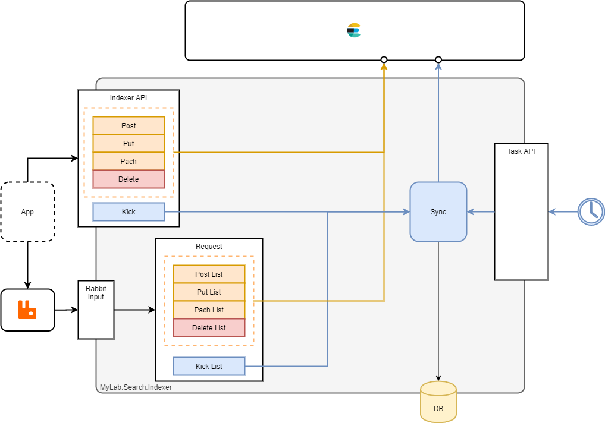

# MyLab.Search.Indexer

Ознакомьтесь с последними изменениями в [журнале изменений](/CHANGELOG.md).

`Docker` образ: [](https://github.com/mylab-search-fx/indexer/pkgs/container/indexer)

Спецификация `API` : [-green)](https://app.swaggerhub.com/apis/ozzy/MyLab.Search.Indexer/2)

Клиент: [](https://www.nuget.org/packages/MyLab.Search.IndexerClient/)

Индексирует данные из базы данных и/или `RabbitMQ` в `ElasticSearch`.

## Обзор



На схеме выше показаны все участники процесса индексации и их связи.

По пути передачи документов для индексации различаются:

* `БД` - индексация по расписанию из БД (синхронизация БД и индексов поиска в `Elasticsearch`);
* `API` - `REST-API` для синхронной индексации;
* `MQ` - отложенная индесация через очередь `RabbitMQ`.

Синхронизация БД различает два способа организации хранения документов:

* `heap` - документы создаются и изменяются в произвольное время;
* `stream` - идентификаторы документов - последовательное число; документы никогда не изменяются. 

Операции индексации через `API` или `MQ`:

* `post` - создание нового документа в индексе;
* `put` - создание нового документа или полное обновление индесированного ранее (сопоставление по идентификатору);
* `patch` - частичное обновление индексированного документа (сопоставление по идентификатору, передаётся частичное содержание тела документа);
* `delete` - удаление индексированного документа (передаётся идентификатор);
* `kick` - добавление или полное обновление документа из БД (передаётся идентификатор).

База данных является приоритетным источником, т.е. если данные об индексируемой сущности приходят через очередь или `api`, то они перезапишутся данными из БД в ближайшей итерации по расписанию;

## Множественная индексация

Приложение `Indexer` определяет абстракцию *индекс*, объединяющую настройки индексации документов из БД, очереди и `api`. `Indexer` через конфигурацию поддерживает указание нескольких *индексов*, что позволяет использовать один экземпляр `Indexer` для индексирования нескольких типов документов, которые индексируются в разных индексах `Elasticsearch` по разным правилам.

Все объявленные *индексы* синхронизируются последовательно, в соответствии с конфигурацией в рамках каждой итерации. При передаче сообщения через `MQ`, идентификатор *индекса* передаётся в теле сообщения. В случае передаче запроса через `API`, идентификатор *индекса* передаётся в адресе запроса.

## Индексация БД

Индексайия БД по сути - это синхранизация документов в БД с индексом в `Elasticsearch`.

Различаются два вида организации данных в БД:

* `heap` (куча):
* `stream` (поток)

### Heap

В *куче* записи могут не иметь явной логической порследовательности. Идентификаторы записей могут иметь строковой или численный тип. Записи могут изменяться в любое время. 

Записи должны иметь поле типа дата+время, которое отражает дату и время последнего изменения записи. Поле может быть `nullable`. Пустое значение будет интерпретироваться как то, что запись никогда не была изменена с момента её создания.

Примером такой *кучи* может быть база заявок, статус которых может меняться со временем. 

### Stream

В *потоке* записи логически выстроены во времени. Идентификатор записи - целочисленное поле с автоинкрементом. Т.е. более поздние записи имеет больший идентификатор. Записи в такой базе не должны меняться со временем. 

Например *потока* - протокол действий пользователя. 

### Синхронизация БД

#### Запуск

Синхронизация БД происходит по запросу в `Task-API` сторонним процессом:

```http
POST /processing
```

При этом запуск синхронизации выполняется асинхронно, т.е. обработка запроса заканчивается правкитески моментально, а процесс синхронизации продолжает работу. Если запрос пришёл во время синхронизации, то он будет проигнорирован. 

Поддерживается получение статуса процесса синхронизации:

```http
GET /processing
```

Описание статуса обработки [тут](https://github.com/mylab-task/task-app#%D1%81%D1%82%D0%B0%D1%82%D1%83%D1%81).

#### Выборка

*Более подробно о настройках в разделе [Конфигурирование](#Конфигурирование)*

*Более подробно о файлах ресурсов в разделе [Файлы ресурсов](#Файлы-Ресурсов)*

В каждой итерации индексатор перебирает все *индексы* из конфигурации, для которых не отключена синхронизация, в порядке их описания. Доступность синхронизации для *индекса* опредлеяется в настройках индекса в поле `EnableSync`.

По каждому индексу последовательно происходит индексация новых данных из БД:

* загружается скрипт выборки: из поля конфигурации `SyncDbQuery` или из соответствующего файла
* загружается предыдущее состояние выборки `seed` или устанавливается минимальное 
  * для `heap` - дата+время изменения последнего проиндексированного документа
  * для `stream` - идентификатор последнего проиндексированного документа 
* происходит порциональная выборка данных и по каждой порции:
  * размер порции определяется настройками *индекса* в поле `SyncPageSize`
  * документы индексируются в индексе `Elasticsearch`, имя которго указано в настройках *индекса* в поле `EsIndex` или используется идентификатор *инлекса* из запроса;   
  * сохраняется состояние выборки `seed`
    * для `heap` - дата+время изменения последнего проиндексированного документа
    * для `stream` - идентификатор последнего проиндексированного документа 

### Требования к скрипту синхронизации

Скрипт синхронизации индекса может быть указан:

* в настройках *индекса* в поле `SyncDbQuery`
* в файле `sync.sql` из директории ресурсов индекса

*Более подробно требованиях к скрипту синхронизации в разделе [Файлы ресурсов](#sync.sql)*

## Индексация через API

Актуальная спецификация API: [-green)](https://app.swaggerhub.com/apis/ozzy/MyLab.Search.Indexer/2). 

Индексация через API - методика передачи запросов через REST-API индесатора для выполнения одиночных синхронных операций с индексами.

API позволяет выполнить запросы:

* `post` - создать новый документ в индексе:
  * ошибка, если документ уже существует
  * тело документа передаётся полностью
* `put` - создать новый документ в индексе или полностью обновить документ в индексе
  * тело документа передаётся полностью
* `patch` - частично обновить документ в индексе
  * тело запроса может содержать часть документа - только те поля. которые надо заменить или добавить
* `kick` - выполнить синхронизацию документа из БД с индексом
  * передаётся идентификатор документа
  * ошибка, если не найден
* `delete` - осуществляется удаление документа из индекса
  * передаётся идентификатор документа

*Термины, приведённые в списке по большей части сооответствуют, но не являются http-методами*.

Каждый метод API выполняет действие над одним документом. Документ должен иметь поле с именем `id` (в любом регистре), содержащим идентификатор документа.

## Индексация через очередь

*Более подробно о настройках в разделе [Конфигурирование](#Конфигурирование)*

Индексация через очередь - слабосвязанная отложенная индексация через брокер очередей `RabbitMQ`. Имя очереди, которую слушает индексатор, указывается в настройках в поле `MqQueue`.

Индексация через очередь позволяет выполнить операции:

* `post` - создать новый документ в индексе:
  * тело документа передаётся полностью
* `put` - создать новый документ в индексе или полностью обновить документ в индексе
  * тело документа передаётся полностью
* `patch` - частично обновить документ в индексе
  * тело запроса может содержать часть документа - только те поля. которые надо заменить или добавить
* `kick` - выполнить синхронизацию документа из БД с индексом
  * передаётся идентификатор документа
  * ошибка, если не найден
* `delete` - осуществляется удаление документа из индекса
  * передаётся идентификатор документа

Каждое сообщение содержит:

* операции только для одного *индекса*
* массивы каждого типа операций: `post`, `put`, `patch`, `kick`, `delete`

Пример сообщения:

```json
{
    "indexId": "foo",
    "kick": [
        "979968895"
    ]
}
```

`Json`-хема сообщения [тут](./doc/mq-msg-scheme.json).

Передаваемые в списках операций документы должны иметь поле с именем `id` (в любом регистре), содержащим идентификатор документа.

## Kick индексация

*Более подробно о настройках в разделе [Конфигурирование](#Конфигурирование)*

*Более подробно о файлах ресурсов в разделе [Файлы ресурсов](#Файлы-Ресурсов)*

Kick-индексайия - методика индексирования, когда сервис индексирует отдельный документ или документы из БД, идентификаторы которых были ему переданы. 

Kick-индексация может быть выполнена с одиночным документом через [REST-API](#Индексация-Через-API)  или с несколькими документами через [очередь](#Индексация-Через-Очередь). 

При Kick-индексации:

* загружается скрипт выборки из настроек *индекса* поля `KickDbQuery` или соответствующего файла
* происходит выборка указанных документов из БД
* документы индексируются с помощью `put`-индексации, т.е. документы создаются в индексе или заменяют ранее проиндексированные документы с тем же идентификатором

### Требования к скрипту выборки

*Более подробно о файлах ресурсов в разделе [Файлы ресурсов](#Файлы-Ресурсов)*

Cкрипт выборки индекса может быть указан:

* в настройках *индекса* в поле `KickDbQuery`
* в файле `kick.sql` из директории ресурсов индекса

*Более подробно требованиях к скрипту выборки в разделе [Файлы ресурсов](#kick.sql)*

## Создание Elasticsearch индексов

*Более подробно о настройках в разделе [Конфигурирование](#Конфигурирование)*

При запуске индексатор перебирает все указанные в настройках индексы.  

По каждому индексу выполняется:

* определение имени индекса в `Elasticsearch`, которое берётся из настроек индекса из поля `EsIndex` или используется идентификатор *инлекса* из запроса;
* проверка существования индекса в `Elasticsearch` по имени
* если индекс не существует, то:
  * загружается запрос создания индекса из файла `index.json` из директории файлов ресурсов *индекса*
  * создаётся индекс в `Elasticsearch` 

В процессе работы приложения, при индексации документов если возникает ошибка, связанная с отсутствием целевого индекса в `Elasticsearch`, то индесатор:

* загрузит запрос создания индекса из файла `index.json` из директории файлов ресурсов *индекса*;
* создаcn индекс в `Elasticsearch`;
* повторно выполнит неудавшуюся операцию.

**Важно заметить**, что по умолчанию `Elasticsearch` автоматически создаёт индекс, если его нет при поптытке индексировать документы. При этом мэпппинг индекса создаётся автоматически на основе состава переданного документа, что может не соответствовать требуемому мэппингу и повлиять на результаты поиска в дальнейшем. Для этого рекомендуется отключить автоматическое создание индексов в `Elasticsearch`. Например, это моэно сделать, установив соответственную переменную окружения:

```
action.auto_create_index=.watches,.triggered_watches,.watcher-history-*
```

*Более подробно о файле в разделе [Файлы ресурсов](#index.json)*

## Конфигурирование

Настроки конфигурации делятся на следующие группы, представленные узлами конфигурации:

* `DB` - настройки работы с БД;
* `MQ` - настройки работы с `RabbitMQ`;
* `ES` - настройки работы с `ElasticSearch`;
* `Indexer` - настройки логики индексирования. 

### `DB` настроойки

Формат узла конфигурации должен соответствовать формату [MyLab.Db со строкой подключения по умолчанию](https://github.com/mylab-tools/db#%D0%B4%D0%B5%D1%82%D0%B0%D0%BB%D1%8C%D0%BD%D0%BE%D0%B5-%D0%BE%D0%BF%D1%80%D0%B5%D0%B4%D0%B5%D0%BB%D0%B5%D0%BD%D0%B8%D0%B5). Кроме того, в узле должны быть указаны дополнительные параметры:

* `Provider` - имя поставщика данных (характеризует субд):
  * `sqlite`
  * `mysql`
  * `oracel`

Пример узла конфигурации `DB`:

```json
{
  "DB": {
    "User": "foo",
    "Password": "bar",
    "ConnectionString": "Server=myServerAddress;Database=myDataBase;Uid={User};Pwd={Password};",
    "Provider": "sqlite"
  }
}
```

### `MQ` настройки

Формат узла конфигурации должен соответствовать формату [MyLab.Mq](https://github.com/mylab-tools/mq#%D0%BA%D0%BE%D0%BD%D1%84%D0%B8%D0%B3%D1%83%D1%80%D0%B8%D1%80%D0%BE%D0%B2%D0%B0%D0%BD%D0%B8%D0%B5):

```json
{
  "MQ": {
    "Host" : "myhost.com",
    "VHost" : "test-host",
    "User" : "foo",
    "Password" : "foo-pass"
  }
}
```

### `ES` настройки

Данный узел должен содержать следущие параметры:

* `Url` - адрес подключения к `ElasticSearch` .

Пример узла конфигурации `ES`:

```json
{
  "ES": {
    "Url" : "http://localhost:9200"
  }
}
```

### `Indexer` настройки логики индексирования

Данный узел должен содержать следущие параметры:

* `ResourcesPath` - базовый путь к директориям ресурсов *индексов*. По умолчанию - `/etc/mylab-indexer/indexes`;
* `SeedPath` - базовый путь к директории, где будут храниться `seed`-ы *индексов*. По умолчанию - `/var/libs/mylab-indexer/seeds`
* `EsNamePrefix` - префикс, который будет добавляться к началу имени всех сущностей в `Elasticsearch`: индексов, потоков, шаблонов и т.д. (будет переведён в нижний регистр);
* `EsNamePostfix` - постфикс, который будет добавляться в конце имени всех сущностей в `Elasticsearch`: индексов, потоков, шаблонов и т.д. (будет переведён в нижний регистр);
* `MqQueue` - имя очереди в `RabbitMQ` для входящих сообщений индексации;
* `Indexes` - настройки *индексов*:
  * `Id` - литеральный идентификатор *индекса*. Например, `users` при индексации информации о пользователях;
  * `IndexType` - тип организации индексируемых данных: `Heap` (по умолчанию) / `Stream`;
  * `IdPropertyType` - тип свойства, идентифицирующего сущность: `String`/`Int`. Нет значения по умолчанию;
  * `EnabledSync` - включение синхронизации БД: `true`(по умолчанию) / `false`;
  * `SyncPageSize` - размер страницы выборки при синхронизации;
  * `SyncDbQuery` - `SQL` запрос выборки данных для индексации при синхронизации;
  * `KickDbQuery` - `SQL` запрос выборки данных для `kick`-индексации;
  * `EsIndex` - если указан, определяет имя целевого индекса в `Elasticsearcch` (будет переведён в нижний регистр).
* `DefaultIndexOptions` - настройки индексов по умолчанию (если нет соответствующей записи в `Indexes`)
  * `IdPropertyType` - тип свойства, идентифицирующего сущность: `String`/`Int`. Нет значения по умолчанию;
  * `IndexType` - тип организации индексируемых данных: `Heap` (по умолчанию) / `Stream`;


Пример узла конфигурации `Indexer`:

```json
{
  "Indexer": {
	"MqQueue": "my-queue",
    "Indexes":[ 
      {
        "Id": "users",
        "IdPropertyType" : "Int",
        "LastChangeProperty" : "LastChangeDt",
        "SyncPageSize": "100",
        "SyncDbQuery": "select Id, Content from test_tb where Id > @seed limit @limit offset @offset",
        "EsIndex": "users-index"      
      }
    ]
  }
}
```

## Файлы ресурсов

Файлы ресурсов располагаются в директории, указанной в настройках индексатора в поле `ResourcesPath`. По умолчанию `/etc/mylab-indexer` . Это общая директория ресурсов. Её содержание:

* `indexes` - директория с ресурсами индексов. Непосредственно в этой директории находятся общие ресурсы для для всех индексов и одноимённые директории с индивидуальными ресурсами для индексов. Например, для индекса `foo`, директория с ресурсами будет `/etc/mylab-indexer/indexes/foo`;
  * `index.json` - общий файл настроек индекса, [подробнее](#index.json);
  * именная директория - одноимённая директория с ресурсами индекса:
    * `sync.sql` - SQL-скрипт выборки данных из БД для индексации, [подробнее](#sync.sql);
    * `kick.sql` - SQL-скрипт выборки данных из БД по идентификаторам для индексации, [подробнее](#kick.sql);
    * `index.json` - файл настроек индекса, [подробнее](#index.json);
* `lifecycles` -  директория, содержащая файлы жизненных циклов;
* `component-templates` -  директория, содержащая файлы шаблонов компонентов;

### sync.sql

Файл `sync.sql` содержит `SQL`-скрипт для выборки данных из БД с целью синхронизации с индексом.

Скрипт должен содержать:

* список выбранных полей с именами или псевдонимами (alias), соответствующими именам полей индексируемых документов, включая регистр;

* список выбранных полей должен содержать поле с именем `id` (в любом регистре), содержащий идентификатор документа;

* параметры пагинации с применением переменных `offset` и `limit`, которые указывают сдвиг и лимит выборки, соответственно; 

* условие выборки с применением переменной `seed`:

  * для `heap`:

    * тип переменной `seed` определяется приложением, как дата+время
    * условие сравнения должно быть (`[value]` - условное обозначение):
      * `[value] > @seed` если значение не-`nullable`
      * `[value] is null or [value] > @seed` если значение `nullable`

    * значение для сравнения должно содержать дату+время последнего изменения записи 

  * для `stream`:

    * тип переменной `seed` определяется приложением, как целочисленное
    * условие сравнения должно быть `value > @seed`
    * значение для сравнения должно содержать идентификатор записи

Пример скрипта:

```sql
select id, content from test_doc where changed is null or changed > @seed limit @offset, @limit
```

### kick.sql

Файл `kick.sql` содержит `SQL`-скрипт для выборки данных БД по идентификаторам с целью индексации этих данных.

Скрипт должен содержать:

* список выбранных полей с именами или псевдонимами (alias), соответствующими именам полей индексируемых документов, включая регистр;
* список выбранных полей должен содержать поле с именем `id` (в любом регистре), содержащий идентификатор документа;
* условие выборки с применением переменной `id` в виде  (`[value]` - условное обозначение):
  * `... where [value] in (@id)` если нужна поддержка множественной kick-индексации
  * `... where [value] = @id` если нет MQ взаимодействия

Пример скрипта:

```sql
select id, content from test_doc where id in (@id)
```

### index.json

Файл `index.json` содержит тело запроса создания индекса в `Elasticsearch`.

Содержимое файла должно быть в формате `JSON` и соответствовать [документации Elasticsearch](https://www.elastic.co/guide/en/elasticsearch/reference/7.17/indices-create-index.html).

Файл `index.json` может быть указан как для конкретного индекса в персональной директории, так и общий для всех индексов в общей директории. Если указаны оба, то файлы будут объединяться. При этом при конфликтах объединения персональные настройки будут иметь приоритет.

### lifecycles

Директория для размещения файлов настроек жизненных циклов индексов. Содержательная часть файла должна соответствовать [запросу создания/обновления жизненного цикла индекса в Elasticsearch](https://www.elastic.co/guide/en/elasticsearch/reference/7.17/ilm-put-lifecycle.html). А имя должно соответствовать идентификатору этого жизненного цикла, которое будет использоваться при его создании. 

Пример:

```json
{
  "policy": {
    "_meta": {
      "description": "used for protocol"
    },
    "phases": {
      "warm": {
        "min_age": "10d",
        "actions": {
          "forcemerge": {
            "max_num_segments": 1
          }
        }
      },
      "delete": {
        "min_age": "30d",
        "actions": {
          "delete": {}
        }
      }
    }
  }
}
```

При каждом запуске индексатор будет проверять наличие этих жизненных циклов в Elasticsearch и при несовпадении версии, при наличии пометки, что жизненный цикл был создан автоматически, будет обновлять его. А при отсутствии - создавать.

При этом в мета-дату будут добавляться следующие пометки:

* `mylab:creator` - `mylab:searchfx-indexer`;
* `mylab:put-dt` - дата и время создания/обновления;
* `mylab.creator-ver` - версия индексатора, который создал запись;
* `mylab.editor-ver` - версия индексатора, который изменил запись.

Кроме того, при разработке ресурса следует снабдить его пометкой номера версии: `mylab:ver`. При очередном перезапуске, жизненный цикл индекса будет обновлён, если версия отличается от аналогичного значения в `Elasticsearch`.

Тогда жизненный цикл в `Elasticsearch` будет выглядеть так (фазы урезаны для наглядности):

```json
{
  "policy": {
    "_meta": {
      "description": "used for protocol",
      "mylab:creator": "mylab:searchfx-indexer",
      "mylab:put-dt": "2023-01-01T12:00:00",
      "mylab:creator-ver": "1.1.2",
      "mylab:ver" : "1"
    },
    "phases": {
      "warm": {},
      "delete": {}
    }
  }
}
```

*Более подробно о [жизненных циклах индексов](https://www.elastic.co/guide/en/elasticsearch/reference/7.17/ilm-index-lifecycle.html)*.

## Развёртывание

Развёртывание сервиса предусмотрено в виде `docker`-контейнера.

Пример `docker-compose.yml` файла:

```yaml
version: '3.2'

services:
  mylab-search-indexer:
    container_name: mylab-search-indexer
    image: ghcr.io/mylab-search-fx/indexer:latest
    volumes:
    - ./appsettings.json:/app/appsettings.json
    - ./new-index-request.json:/etc/mylab-indexer/indexes/users/index.json
```

## Клиент

Для индексатора разработан клиент на `.NET Core`, доступный в виде `nuget` пакета - [MyLab.Search.IndexerClient](https://www.nuget.org/packages/MyLab.Search.IndexerClient/).

Ключ клиента для конфигурирования - `indexer`. Подробнее о конфигурировании клиента - [тут](https://github.com/mylab-tools/apiclient#%D1%81%D0%BE%D0%BF%D0%BE%D1%81%D1%82%D0%B0%D0%B2%D0%BB%D0%B5%D0%BD%D0%B8%D0%B5-%D0%BA%D0%BE%D0%BD%D1%82%D1%80%D0%B0%D0%BA%D1%82%D0%BE%D0%B2).
